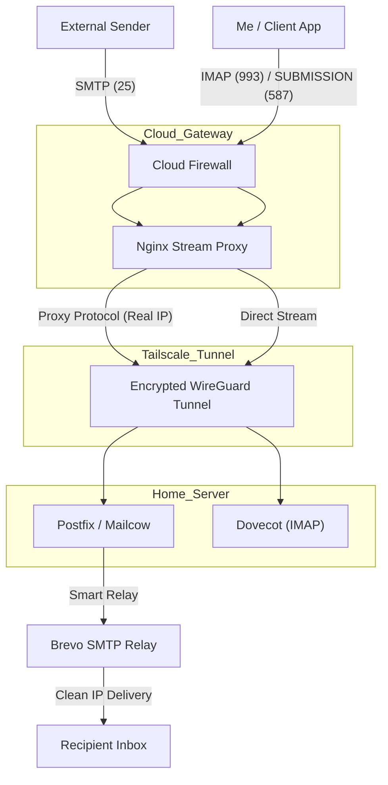

# 📧 Ultimate Home Lab Mail Server (Hybrid Cloud–Premise)

> Transforming a residential Mini PC into an enterprise-grade mail server — bypassing ISP restrictions via secure cloud tunneling.

---

## 📖 Overview

This project demonstrates how to deploy a fully functional **Self-Hosted Mail Server (Mailcow)** on residential hardware (Mini PC) despite common ISP limitations such as:

- No Public IP (CGNAT)
- Dynamic IP address
- Blocked Port 25

A **Hybrid Cloud Architecture** is used where an **Oracle Cloud VPS** acts as a public-facing gateway and securely tunnels traffic to the home server using **Tailscale (WireGuard)**.

The system preserves **Real Client IPs** for accurate logging and security enforcement while using a **Smart Relay** to ensure high email deliverability.

---

## 🏗 Network Topology

The architecture uses a **Bi-directional Proxy** design, separating inbound and outbound traffic flows for better security and compatibility.



---

## 🚀 Key Features

### 🛡️ CGNAT & ISP Bypass
Bypasses the lack of a public IP and blocked Port 25 by securely tunneling traffic through a cloud VPS.

### 🕵️ Real IP Restoration
Implements **PROXY Protocol** between the VPS and the home server so Postfix sees the original sender IP instead of the VPN IP.

This is critical for:

- SPF validation
- Accurate Fail2Ban blocking

### 📧 High Deliverability
Outbound mail is routed through **Brevo SMTP Relay (Port 587)** to ensure inbox delivery and avoid residential IP blacklists.

### 🔒 Secure Tunneling
All traffic between Cloud and Home is encrypted via **WireGuard (Tailscale)**.

---

## ⚙️ Technical Implementation

### 1️⃣ VPS Gateway Configuration (Nginx Stream)

Replaced traditional NAT with **Nginx Stream (Layer 4 proxying)**.

| Port | Purpose | Proxy Protocol |
|------|---------|----------------|
| 25   | Incoming SMTP | Enabled |
| 587  | Mail Submission | Disabled |
| 993  | IMAP over SSL | Disabled |

```nginx
# /etc/nginx/nginx.conf
stream {
    server {
        listen 25;
        proxy_pass 100.x.x.x:25;
        proxy_protocol on;
    }

    server {
        listen 587;
        proxy_pass 100.x.x.x:587;
    }

    server {
        listen 993;
        proxy_pass 100.x.x.x:993;
    }
}
```

---

### 2️⃣ Postfix Configuration (Home Server)

Postfix is configured to accept the HAProxy/PROXY protocol only from the trusted VPN gateway.

```cf
# data/conf/postfix/extra.cf
postscreen_upstream_proxy_protocol = haproxy
# smtpd_upstream_proxy_protocol intentionally not set
```

---

## ✅ Final Result

- Self-hosted mail server running from home
- Real sender IP visibility for security filtering
- Reliable inbox delivery via smart relay
- Fully encrypted cloud-to-home tunnel
